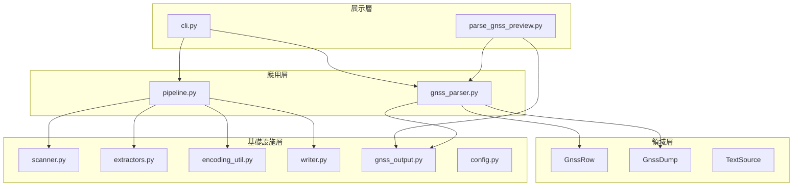
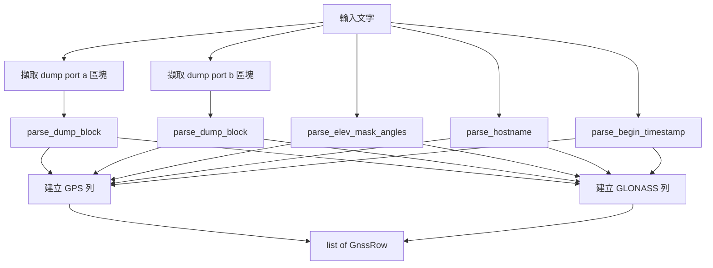

# NAR_SAT_DP 軟體設計規格書（SDS）

| 項目 | 內容 |
|------|------|
| 文件編號 | NAR_SAT_DP_SDS |
| 專案名稱 | NAR_SAT_DP（Network Asset Report — Satellite Data Processing） |
| 版本 | 0.1.0 |
| 狀態 | Draft |
| 最後更新 | 2026-07-01 |
| 對應 SRS | [NAR_SAT_DP_SRS.md](NAR_SAT_DP_SRS.md) v0.1.0 |

---

## 1. 簡介

### 1.1 目的

本文件描述 NAR_SAT_DP 之系統架構、模組劃分、資料結構、處理流程與介面設計，供開發與維護人員實作及擴充時參考。

### 1.2 範圍

涵蓋目前程式庫 `src/nar_sat_dp/` 之設計，包含：

- 已實作之 GNSS 解析與雙格式輸出（`gnss_parser`、`gnss_output`）
- 已實作之批次基礎設施（掃描、解壓、編碼、舊版 pipeline）
- 規劃中之主 CLI 整合

### 1.3 參考文件

| 文件 | 路徑 |
|------|------|
| 軟體需求規格書 | [NAR_SAT_DP_SRS.md](NAR_SAT_DP_SRS.md) |
| 決策紀錄 | [DECISIONS.md](DECISIONS.md) |
| 專案說明 | [../README.md](../README.md) |

---

## 2. 系統架構

### 2.1 邏輯分層



### 2.2 部署架構


| 階段 | 元件 | 說明 |
|------|------|------|
| 開發 | Python 3.10+、`pip install -e .` | 模組化開發與單元測試 |
| 打包 | `scripts/build.ps1`（PyInstaller `--onefile`） | 內嵌 `py7zr`、`openpyxl` |
| 發佈 | `dist/NAR_SAT_DP_<版本>.zip` | exe + LICENSE + NOTICE + `THIRD_PARTY/` + `BUILD.md` |
| 執行 | 解壓後 `nar_sat_dp.exe` | 使用者無需 Python；可拖放或 CLI |

### 2.3 實作狀態

| 元件 | 狀態 | 說明 |
|------|------|------|
| `gnss_parser.py` | **已完成** | 核心 GNSS 解析 |
| `gnss_output.py` | **已完成** | CSV + Excel 雙輸出 |
| `scripts/parse_gnss_preview.py` | **已完成** | 預覽/驗證腳本 |
| `pipeline.py` + `cli.py` | **部分完成** | 舊版 `fields.json` 流程，待整合 GNSS |
| `parser.py` + `fields.json` | **Legacy** | 初期 placeholder，非 GNSS 正式路徑 |

---

## 3. 目錄結構

```
NAR_SAT_DP/
├── config/
│   ├── pipeline.json          # 批次行為設定
│   └── fields.json            # Legacy 欄位規則
├── docs/
│   ├── NAR_SAT_DP_SRS.md
│   ├── NAR_SAT_DP_SDS.md
│   ├── DECISIONS.md
│   ├── BUILD.md
│   └── DISTRIBUTION.md
├── packaging/
│   ├── licenses/LGPL-2.1.txt
│   ├── RELEASE_README.txt
│   └── SOURCE_OFFER.txt
├── scripts/
│   ├── parse_gnss_preview.py  # GNSS 預覽入口
│   ├── create_sample_archives.py
│   ├── build.ps1
│   └── write_release_metadata.py
└── src/nar_sat_dp/
    ├── cli.py
    ├── pipeline.py
    ├── gnss_parser.py         # ★ GNSS 核心
    ├── gnss_output.py         # ★ 輸出
    ├── scanner.py
    ├── extractors.py
    ├── encoding_util.py
    ├── config.py
    ├── writer.py
    └── parser.py              # Legacy
```

---

## 4. 模組設計

### 4.1 輸入掃描與解壓

#### 4.1.1 `scanner.collect_input_paths`

| 項目 | 說明 |
|------|------|
| 輸入 | `list[Path]` 使用者路徑、`PipelineConfig` |
| 輸出 | 去重後之 `list[Path]`（`.txt` / `.zip` / `.7z`） |
| 行為 | 資料夾依 `recursive_scan` 遞迴 `rglob` |

#### 4.1.2 `extractors`

| 函式 | 說明 |
|------|------|
| `read_txt_file` | 讀取實體 `.txt`，自動解碼 |
| `iter_txt_from_zip` | 記憶體內解 zip，回傳 `TextSource` 列表 |
| `iter_txt_from_7z` | 暫存目錄解 7z（`py7zr`），回傳 `TextSource` 列表 |

**`TextSource` 資料結構**：

| 欄位 | 型別 | 說明 |
|------|------|------|
| content | str | 解碼後全文 |
| source_archive | str | 來源壓縮檔路徑（無則空字串） |
| source_txt_path | str | txt 路徑或壓縮檔內相對路徑 |
| encoding | str | 使用之編碼名稱 |

### 4.2 GNSS 解析（`gnss_parser.py`）

#### 4.2.1 處理流程



#### 4.2.2 區段擷取

以字串 marker 定位（`_extract_between`）：

| 區段 | 起始 marker | 結束 marker |
|------|-------------|-------------|
| dump A | `tools dump port a/gnss gnss` | `tools dump port b/gnss gnss` |
| dump B | `tools dump port b/gnss gnss` | `show port a/gnss \| match "Angle     :"` |
| show A | `show port a/gnss \| match "Angle     :"` | `show port b/gnss \| match "Angle     :"` |
| show B | `show port b/gnss \| match "Angle     :"` | `logout` |

#### 4.2.3 衛星表解析（`parse_dump_block`）

1. 逐行比對 `SAT_ROW_RE`：`^(GPS|GLONASS)\s+\S+\s+\S+\s+(\d+)\s*$`
2. 依 Constellation 分組累積 C/No 整數列表（**保留 log 原始順序**）
3. 讀取 `No. of Used Satellites: N` 作為 `total_used`

#### 4.2.4 列建構規則

對 `CONSTELLATIONS = ("GPS", "GLONASS")` 各產生一列（若 A、B 皆無該系統資料則跳過）：

| GnssRow 欄位 | 指派邏輯 |
|--------------|----------|
| control | GPS→`A`，GLONASS→`B` |
| elev_mask_angle | GPS→show A；GLONASS→show B |
| used_satellite_control | GPS→dump A total；GLONASS→dump B total |
| used_satellite_constellation | `{len(a)+len(b)}({len(a)}+{len(b)})` |
| a_signals | `_pad_signals(dump_a.signals[constellation])` |
| b_signals | `_pad_signals(dump_b.signals[constellation])` |
| script_begin_time | `[BEGIN]` 擷取值 |

**常數**：

```python
MAX_SIGNALS = 16
SIGNAL_PAD = "-"
```

#### 4.2.5 正則一覽

| 名稱 | 用途 |
|------|------|
| `BEGIN_RE` | `[BEGIN]` 時間行 |
| `HOSTNAME_RE` | `^A:([^#]+)#` |
| `SAT_ROW_RE` | 衛星資料列 |
| `USED_TOTAL_RE` | dump 結尾總衛星數 |
| `ELEV_RE` | `Elev. Mask Angle : {n}` |

### 4.3 輸出（`gnss_output.py`）

#### 4.3.1 `build_headers`

依序組裝 39～41 欄（含/不含 source）：

```
固定 6 欄 + A signal×16 + B signal×16 + script_begin_time [+ source×2]
```

#### 4.3.2 `write_gnss_csv`

- 編碼：UTF-8 with BOM（`utf-8-sig`）
- `csv.DictWriter` + `QUOTE_MINIMAL`

#### 4.3.3 `write_gnss_xlsx`

| 列 | 內容 |
|----|------|
| 第 1 列 | 固定欄標題 + `A signal 1...16` 合併 + `B signal 1...16` 合併 + `script_begin_time` [+ source] |
| 第 2 列 | A/B 訊號欄下標 1…16 |
| 第 3 列起 | 資料列 |

**合併規則**（每 NE 連續 2 列）：

| 欄位 | 合併 |
|------|------|
| hostname | 是 |
| Elev. Mask Angle | **否** |
| script_begin_time | 是 |
| source_archive / source_txt_path | 是 |

實作：`openpyxl` `merge_cells`，每 2 列為一組 NE。

### 4.4 批次 Pipeline（`pipeline.py`，Legacy 路徑）

```
collect_input_paths → 逐檔解壓/讀取 → parse_text(fields.json) → write_csv
```

**整合計畫**（待實作）：

1. 將 `parse_gnss_text` 取代 `parse_text`
2. 呼叫 `write_gnss_csv` + `write_gnss_xlsx`
3. 更新 `cli.py` 之 `-o` 語意為輸出基底名稱（副檔名由程式附加）

### 4.5 編碼（`encoding_util.decode_bytes`）

依序嘗試 `utf-8-sig` → `utf-8` → `cp950`；全失敗則拋 `UnicodeDecodeError`，由上層記錄錯誤並跳過檔案。

---

## 5. 資料設計

### 5.1 `GnssRow`（輸出列模型）

| 屬性 | 型別 | 對應輸出欄 |
|------|------|------------|
| hostname | str | hostname |
| control | str | Control |
| elev_mask_angle | str | Elev. Mask Angle |
| used_satellite_control | str | Used Satellite(Control) |
| constellation | str | Constellation |
| used_satellite_constellation | str | Used Satellite(Constellation) |
| a_signals | list[str] len=16 | A signal 1…16 |
| b_signals | list[str] len=16 | B signal 1…16 |
| script_begin_time | str | script_begin_time |
| source_archive | str | source_archive |
| source_txt_path | str | source_txt_path |

`to_flat_dict()` 轉為 `dict[str, str]` 供 CSV/Excel 寫入。

### 5.2 `GnssDump`（中間結構）

| 屬性 | 型別 | 說明 |
|------|------|------|
| signals | dict[str, list[int]] | `GPS` / `GLONASS` → C/No 列表 |
| total_used | int | dump 結尾總數 |

### 5.3 合併輸出資料流

多檔處理時，各檔 `parse_gnss_text` 回傳之 `list[GnssRow]` **串接**為單一 `list[GnssRow]`，一次寫入同一 CSV/XLSX。

---

## 6. 介面設計

### 6.1 CLI（目標介面，整合後）

```text
nar_sat_dp.exe <inputs...> -o <output_basename> [-c pipeline.json]
```

| 參數 | 說明 |
|------|------|
| inputs | 一個或多個檔案/資料夾路徑 |
| -o, --output | 輸出基底路徑（產出 `.csv`、`.xlsx`） |
| -c, --config | `pipeline.json` 路徑 |
| --version | 顯示版本 |

### 6.2 預覽腳本（現行）

```text
python scripts/parse_gnss_preview.py <inputs...> -o <output_basename>
```

直接呼叫 `parse_gnss_text` + `write_gnss_csv` + `write_gnss_xlsx`，不經 `pipeline.py`。

### 6.3 設定檔 `pipeline.json`

| 區段 | 用途 |
|------|------|
| txt_glob / archive_extensions | 掃描副檔名 |
| recursive_scan | 是否遞迴 |
| encoding | 輸入 fallback 順序、輸出編碼 |
| error_handling | 錯誤 log 後綴、進度間隔 |
| seven_zip | 是否啟用 7z |

---

## 7. 錯誤處理設計

| 情境 | 行為 |
|------|------|
| 單檔解碼失敗 | 記錄 ERROR，跳過，繼續 |
| 單檔解析失敗（缺 hostname 等） | 記錄 ERROR，跳過，繼續 |
| 單檔無 GPS/GLONASS | 記錄 ERROR，跳過 |
| 壓縮檔解壓失敗 | 記錄 ERROR，跳過 |
| 至少一列成功 | 產出 CSV/XLSX，結束碼 0 或 1 |
| 全部失敗 | 不產出主檔，結束碼 2 |

`ErrorLog`（`writer.py`）寫入 `{output_stem}_errors.log`。

---

## 8. 測試設計

### 8.1 驗證用例

| 用例 ID | 輸入 | 預期 |
|---------|------|------|
| TC-01 | `10.218.255.121_...txt` | 2 列；GPS `18(9+9)`；GLONASS `8(4+4)` |
| TC-02 | `new 7.txt` | 2 列；GPS `20(10+10)`；GLONASS `10(6+4)` |
| TC-03 | `new 7.txt` + `new 8.txt` | 4 列合併 |
| TC-04 | 輸出 XLSX | hostname 合併；Elev 不合併 |
| TC-05 | 欄位順序 | `source_*` 在最後兩欄 |

### 8.2 執行方式

```powershell
.\.venv\Scripts\python scripts/parse_gnss_preview.py `
  "references/samples/10.218.255.121_2026-06-30_17-09-01.txt" `
  -o "references/samples/_preview_test"
```

---

## 9. 安全性與限制

| 項目 | 說明 |
|------|------|
| 輸入驗證 | 僅解析文字；不執行 log 內容 |
| 路徑 | 使用 `pathlib`；不寫入輸入目錄以外（除指定輸出路徑） |
| 7z 解壓 | 使用系統暫存目錄，處理完即釋放 |
| 限制 | 訊號欄固定 16；超過截斷；不支援 GPS/GLONASS 以外系統 |

---

## 10. 修訂紀錄

| 版本 | 日期 | 說明 |
|------|------|------|
| 0.1.0 | 2026-07-01 | 初版；反映 gnss_parser / gnss_output 現況與 pipeline 整合待辦 |

---

## 附錄 A：需求—模組追溯矩陣

| SRS ID | 模組 / 函式 |
|--------|-------------|
| FR-01～06 | `scanner`, `extractors`, `cli` |
| FR-10～19 | `gnss_parser.parse_gnss_text` |
| FR-20～31 | `GnssRow`, `parse_dump_block`, `parse_elev_mask_angles` |
| FR-40～44 | `gnss_output.write_gnss_csv`, `write_gnss_xlsx` |
| FR-45～54 | `pipeline.run`, `ErrorLog` |
| NFR-03 | `encoding_util.decode_bytes` |

## 附錄 B：輸出欄位索引（含 source）

| 索引 | 欄位名 |
|------|--------|
| 1–6 | hostname … Used Satellite(Constellation) |
| 7–22 | A signal 1…16 |
| 23–38 | B signal 1…16 |
| 39 | script_begin_time |
| 40–41 | source_archive, source_txt_path |
