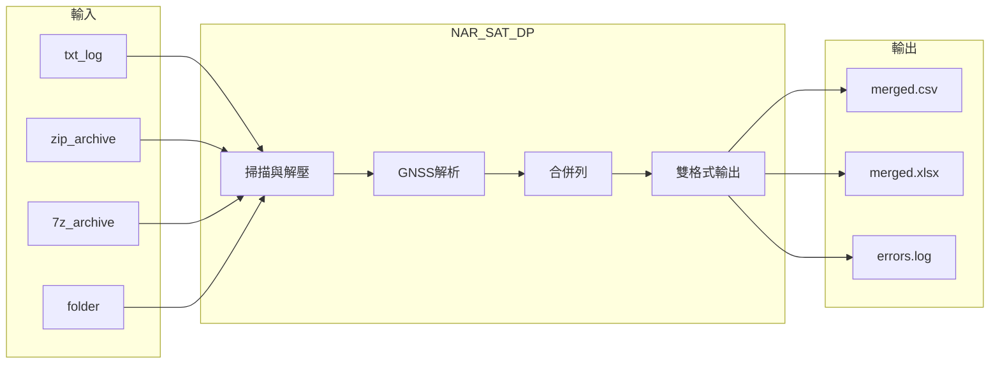

# NAR_SAT_DP 軟體需求規格書（SRS）

| 項目 | 內容 |
|------|------|
| 文件編號 | NAR_SAT_DP_SRS |
| 專案名稱 | NAR_SAT_DP（Network Asset Report — Satellite Data Processing） |
| 版本 | 0.1.0 |
| 狀態 | Draft |
| 最後更新 | 2026-07-01 |

---

## 1. 簡介

### 1.1 目的

本文件定義 **NAR_SAT_DP** 系統之軟體需求，作為開發、測試、驗收與維護之依據。讀者包含專案利害關係人、開發人員與測試人員。

### 1.2 範圍

NAR_SAT_DP 為 Windows 平台之**離線批次資料處理工具**，用途如下：

1. 讀取網路設備（NE）GNSS 巡檢 log（`.txt` 或壓縮檔內 `.txt`）
2. 依固定規則解析控制卡 A/B 之衛星狀態
3. 將多台設備、多個檔案之結果**合併**輸出為結構化報表（`.csv` + `.xlsx`）

本系統**不包含**：即時連線設備、圖形化設定介面、雲端上傳、使用者帳號管理。

### 1.3 定義與縮寫

| 術語 | 說明 |
|------|------|
| NE | Network Element，網路設備（一台設備對應一次 SSH session log） |
| 控制卡 A / B | 設備上兩張 GNSS 控制卡，log 中對應 `port a` / `port b` 指令 |
| Constellation | 衛星系統；本專案僅處理 **GPS**、**GLONASS** |
| C/No | 訊號強度（Carrier-to-Noise），單位 dB-Hz |
| `[BEGIN]` | 正式 log 中標記 script 開始時間之前綴行 |
| Flat CSV | 每列每欄一值、無合併儲存格之 CSV |

### 1.4 參考文件

| 文件 | 路徑 |
|------|------|
| 決策與規格紀錄 | [DECISIONS.md](DECISIONS.md) |
| 軟體設計規格書 | [NAR_SAT_DP_SDS.md](NAR_SAT_DP_SDS.md) |
| 專案說明 | [../README.md](../README.md) |
| 範例 log | [../references/samples/](../references/samples/) |

---

## 2. 總體說明

### 2.1 產品觀點



### 2.2 使用者特性

| 角色 | 說明 | 技術能力 |
|------|------|----------|
| 維運工程師 | 執行批次轉檔、檢視 Excel 報表 | 熟悉 Windows 檔案總管、可拖放 exe |
| 資料分析人員 | 以 CSV/Excel 做後續統計 | 熟悉 Excel，不一定具程式能力 |

### 2.3 作業環境

| 項目 | 需求 |
|------|------|
| 作業系統 | Windows 10 或以上 |
| 執行方式 | 單一 `.exe`（PyInstaller 打包），**無需**安裝 Python、7-Zip |
| 磁碟 | 足以容納輸入 log 與輸出報表 |
| 網路 | 非必要（離線運作） |

### 2.4 設計與實作約束

| 編號 | 約束 |
|------|------|
| C-01 | 使用者端零外部依賴（執行期不需 pip / 7-Zip） |
| C-02 | 開發語言：Python 3.10+ |
| C-03 | 輸入支援 `.txt`、`.zip`、`.7z` |
| C-04 | 每台 NE 固定產出 GPS、GLONASS 兩列（若該系統無資料則不產該列） |
| C-05 | 每控制卡、每 Constellation 訊號欄位上限 **16** |
| C-06 | 僅處理 GPS / GLONASS；其他 Constellation 略過 |

---

## 3. 功能需求

### 3.1 輸入與掃描

| ID | 需求描述 | 優先級 |
|----|----------|--------|
| FR-01 | 系統應接受一個或多個輸入路徑（檔案或資料夾） | 必須 |
| FR-02 | 對資料夾應**遞迴**掃描 `.txt`、`.zip`、`.7z` | 必須 |
| FR-03 | 應自 `.zip` 內擷取所有 `.txt` 並處理 | 必須 |
| FR-04 | 應自 `.7z` 內擷取所有 `.txt` 並處理 | 必須 |
| FR-05 | 多個輸入來源之結果應合併至**同一份** CSV 與 XLSX | 必須 |
| FR-06 | 支援 CLI 參數啟動與拖放檔案/資料夾至 exe | 必須 |

### 3.2 Log 解析

| ID | 需求描述 | 優先級 |
|----|----------|--------|
| FR-10 | 每個 `.txt` 視為**一次 SSH session = 一台 NE** | 必須 |
| FR-11 | 應自 prompt 列 `A:{hostname}#` 擷取 hostname | 必須 |
| FR-12 | 應於第一個 hostname 之前尋找 `[BEGIN] {timestamp}`，擷取為 `script_begin_time` | 必須 |
| FR-13 | 應解析 `tools dump port a/gnss gnss` 之衛星表（控制卡 A） | 必須 |
| FR-14 | 應解析 `tools dump port b/gnss gnss` 之衛星表（控制卡 B） | 必須 |
| FR-15 | 應解析 `show port a/b/gnss \| match "Angle     :"` 之 `Elev. Mask Angle` | 必須 |
| FR-16 | 應忽略 `environment no more`、`logout` 及 SSH 包裝雜訊 | 必須 |
| FR-17 | 衛星表應依 **Constellation 連續分塊**；GPS 產第 1 列、GLONASS 產第 2 列 | 必須 |
| FR-18 | 每筆衛星資料列應擷取最後一欄數字作為 C/No 訊號強度 | 必須 |
| FR-19 | 若某 Constellation 在 A、B 兩卡皆無資料，則不產該列 | 必須 |

### 3.3 輸出欄位語意

| ID | 欄位 | 規則 | 優先級 |
|----|------|------|--------|
| FR-20 | hostname | 兩列相同 | 必須 |
| FR-21 | Control | GPS 列=`A`；GLONASS 列=`B` | 必須 |
| FR-22 | Elev. Mask Angle | GPS 列=控制卡 A；GLONASS 列=控制卡 B | 必須 |
| FR-23 | Used Satellite(Control) | 各控制卡 dump 結尾 `No. of Used Satellites: N` | 必須 |
| FR-24 | Constellation | `GPS` 或 `GLONASS` | 必須 |
| FR-25 | Used Satellite(Constellation) | 格式 `{總數}({卡A數}+{卡B數})`，例 `18(9+9)` | 必須 |
| FR-26 | A signal 1…16 | 控制卡 A、該 Constellation 之 C/No 序列 | 必須 |
| FR-27 | B signal 1…16 | 控制卡 B、該 Constellation 之 C/No 序列 | 必須 |
| FR-28 | 訊號補位 | 不足 16 筆以 `-` 填滿；超過 16 筆取前 16 筆 | 必須 |
| FR-29 | script_begin_time | 兩列相同 | 必須 |
| FR-30 | source_archive | 批次時填來源壓縮檔路徑；否則留空 | 必須 |
| FR-31 | source_txt_path | 批次時填來源 txt 路徑（含壓縮檔內相對路徑） | 必須 |

**欄位順序**（由左至右）：

`hostname` → `Control` → `Elev. Mask Angle` → `Used Satellite(Control)` → `Constellation` → `Used Satellite(Constellation)` → `A signal 1…16` → `B signal 1…16` → `script_begin_time` → `source_archive` → `source_txt_path`

### 3.4 輸出格式

| ID | 需求描述 | 優先級 |
|----|----------|--------|
| FR-40 | 每次執行應同時產出 `.csv` 與 `.xlsx` | 必須 |
| FR-41 | CSV 為 UTF-8 with BOM、逗號分隔、標準引號規則 | 必須 |
| FR-42 | Excel 應有雙層標題：`A signal 1…16`、`B signal 1…16` 區塊水平合併 | 必須 |
| FR-43 | Excel 同一 NE 之 GPS/GLONASS 兩列應合併：`hostname`、`script_begin_time`、`source_*` | 必須 |
| FR-44 | Excel 之 `Elev. Mask Angle` **不得**跨列合併 | 必須 |
| FR-45 | 部分檔案失敗時仍應產出已解析資料，並寫入錯誤 log | 必須 |

### 3.5 錯誤處理與結束碼

| ID | 需求描述 | 優先級 |
|----|----------|--------|
| FR-50 | 產出 `<輸出檔名>_errors.log` 記錄錯誤與警告 | 必須 |
| FR-51 | 結束碼 0：全部成功 | 必須 |
| FR-52 | 結束碼 1：有錯誤/警告但已產出報表 | 必須 |
| FR-53 | 結束碼 2：無法產出任何報表 | 必須 |
| FR-54 | 大量檔案處理時應顯示進度（stderr） | 應有 |

---

## 4. 非功能需求

| ID | 類別 | 需求描述 |
|----|------|----------|
| NFR-01 | 可用性 | 支援拖放與 CLI，無需安裝執行環境 |
| NFR-02 | 效能 | 單執行緒；適用數百～數千 txt 之辦公室批次規模 |
| NFR-03 | 編碼 | 輸入自動偵測 UTF-8 BOM → UTF-8 → CP950；解碼失敗則跳過該檔 |
| NFR-04 | 可維護性 | 提供 `--version`；核心解析規則文件化 |
| NFR-05 | 可攜性 | 交付物為單一 exe + 可選 `config/pipeline.json` |
| NFR-06 | 可追溯性 | 輸出含 `source_archive`、`source_txt_path`、`script_begin_time` |

---

## 5. 外部介面需求

### 5.1 使用者介面

| 介面 | 說明 |
|------|------|
| CLI | `nar_sat_dp.exe <輸入路徑...> -o <輸出基底名稱> [-c pipeline.json]` |
| 拖放 | 將檔案/資料夾拖至 exe；未指定 `-o` 時預設同目錄 `merged` |
| 說明 | `--help`、`--version` |

### 5.2 檔案介面

**輸入**：符合 §3.2 結構之 `.txt`；或含此類檔案之 `.zip` / `.7z`。

**輸入 log 最小結構範例**（正式版）：

```text
[BEGIN] 2026/6/30 下午 05:09:01
A:{hostname}# tools dump port a/gnss gnss
... 衛星表 ...
A:{hostname}# tools dump port b/gnss gnss
... 衛星表 ...
A:{hostname}# show port a/gnss | match "Angle     :"
Ant. Cable Delay   : ...    Elev. Mask Angle     : {n}
A:{hostname}# show port b/gnss | match "Angle     :"
...
```

**輸出**：

- `{basename}.csv`
- `{basename}.xlsx`
- `{basename}_errors.log`（有錯誤時）

### 5.3 設定檔介面

`config/pipeline.json` 控制掃描、編碼、錯誤處理等行為（GNSS 欄位規則為程式內建，見 SDS）。

---

## 6. 驗收準則

| ID | 準則 |
|----|------|
| AC-01 | 以 `references/samples/10.218.255.121_2026-06-30_17-09-01.txt` 解析，GPS 列 `Used Satellite(Constellation)` = `18(9+9)`，GLONASS 列 = `8(4+4)` |
| AC-02 | 以 `references/samples/new 7.txt` 解析，GPS 列 `20(10+10)`，GLONASS 列 `10(6+4)` |
| AC-03 | 合併多個 txt 後 CSV/XLSX 列數 = 各檔有效列數之和 |
| AC-04 | Excel 中同一 NE 的 hostname 儲存格合併為一；Elev. Mask Angle 不合併 |
| AC-05 | 欄位順序符合 §3.3；`source_*` 在最後兩欄 |
| AC-06 | 在無 Python 環境之 Windows 上，exe 可獨立完成轉檔 |

---

## 7. 需求追溯（摘要）

| 需求區段 | 設計對應 | 實作模組 |
|----------|----------|----------|
| FR-01～06 | SDS §4.1 | `scanner.py`, `extractors.py`, `cli.py` |
| FR-10～19 | SDS §4.2 | `gnss_parser.py` |
| FR-20～31 | SDS §5 | `gnss_parser.py`, `GnssRow` |
| FR-40～44 | SDS §4.3 | `gnss_output.py` |
| FR-45～54 | SDS §4.4 | `pipeline.py`, `writer.py` |
| NFR-03 | SDS §4.5 | `encoding_util.py` |

---

## 8. 未來需求（Out of Scope / 待辦）

| 項目 | 說明 |
|------|------|
| 主 CLI 整合 GNSS 解析 | `nar_sat_dp.cli` 尚使用舊版 `fields.json` pipeline |
| 第三種 Constellation | 目前明確排除 |
| GUI | 不在本版範圍 |
| 動態訊號欄位數 | 目前固定 16 欄 |

---

## 9. 修訂紀錄

| 版本 | 日期 | 作者 | 說明 |
|------|------|------|------|
| 0.1.0 | 2026-07-01 | — | 初版，依現行 DECISIONS 與實作撰寫 |
